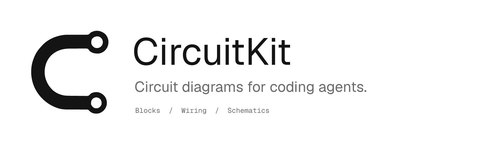

<p align="center">
  
</p>

<p align="center">
  <a href="https://github.com/crafter-lab/circuitkit/stargazers">
    
  </a>
  &nbsp;
  <a href="https://github.com/crafter-lab/circuitkit/blob/main/LICENSE">
    
  </a>
  &nbsp;
  <a href="https://circuitkit.crafter.ing">
    
  </a>
</p>

<p align="center">
  <a href="docs/guide.md">Guide</a> ·
  <a href="examples">Examples</a> ·
  <a href="https://github.com/crafter-lab/circuitkit">GitHub</a>
</p>

Clean circuit SVGs for your own project, with optional interactive explanations and portable PNG. A typed package, React components, local CLI, and agent skill share one JSON document. No account or backend. Not a simulator.

## Sections, highlights and flow

An optional `presentation` block in .ck source names sections, highlights existing modules/ports/buses/links and defines illustrative sweeps on declared connections. Scenes reuse the same layout and never change connectivity. The playground at `/editor?mode=circuitkit` and the landing use the same viewer. `/markdown` redirects to the playground; Markdown fences remain supported by the CLI and library.

See [the presentation contract](docs/presentation.md) and [Cueva with scenes](examples/diagrams/cueva-presentation.ck). Playback is currently part of the bundled web app; library compilation exposes presentation plans, not a new React playback component. Reduced motion uses static direction cues. SVG/PNG exports remain static base diagrams. Not simulation, relay behavior, animated exports or a claim of deployment/publication.

## Install package

Node.js 20 or newer. Install the CLI and library in your project:

```sh
npm install circuitkit
npx circuitkit skills get core --text
npx circuitkit --version
```

For Bun projects: `bun add circuitkit`, then `bunx circuitkit`. To run without adding a dependency, use `npx --yes circuitkit@latest`. Keep a project's pinned version unless you intend to upgrade it.

For contributors, clone this Apache-2.0 repository, then run `bun install`, `bun run build` and `bun test ./tests`. `bun pm pack` produces the distributable tarball; development uses Bun, while the shipped binaries run on Node.

## Install skill

From your project, run:

```sh
npx skills add crafter-lab/circuitkit --skill circuitkit
```

Choose your agent when prompted. No global flag is needed. Append `--list` to inspect available skills without installing. The small [discovery stub](skills/circuitkit/SKILL.md) points to `circuitkit skills get core --text`; the actual authoring guide is packaged with the CLI. Use `circuitkit skills list --json` to discover specialized guides. The stub explains how to use the latest CLI when none is installed, without silently upgrading pinned projects.

## Write the compact text language

Use the bus-grouped text syntax in a `circuitkit` Markdown fence or a `.ck` file. JSON remains compatible. The same source generates blocks, wiring and modular schematics without coordinates:

```text
circuit sensor v1
title "Sensor connection"
view schematic
controller: controller (SDA SCL)
sensor: sensor (SDA SCL)
bus I2C {
  controller.SDA <-> sensor.SDA
  controller.SCL <-> sensor.SCL
}
```

```sh
npx circuitkit grammar --json
npx circuitkit render node_modules/circuitkit/examples/diagrams/cueva.ck --view schematic --out cueva.svg
npx circuitkit render node_modules/circuitkit/examples/diagrams/cueva.md --block 1 --view blocks --out blocks.svg
npx circuitkit format node_modules/circuitkit/examples/diagrams/cueva.ck --out formatted.ck
npx circuitkit expand node_modules/circuitkit/examples/diagrams/audio-system.ck --out system.json
npx circuitkit render node_modules/circuitkit/examples/diagrams/audio-system.ck --scope audio --out audio.svg
```

`define` and `expose` provide reusable, explicitly declared interfaces. Scope and interface projections keep the full resolved system inspectable; a boundary marker is not extra hardware. Source resolution and individual drawing budgets are separate. This is not arbitrary-scale CAD, implicit board lookup or simulation.

Import `renderCircuitSource`, `compileCircuitSource`, `resolveCircuitSource` and `formatCircuitSource` from `circuitkit/language`. The source playground includes highlighting, examples, scope/detail controls and diagnostics with source positions. See the [text-language contract](docs/compact-language.md) or run `circuitkit skills get language --text`.

## Describe a diagram, not its coordinates

For module-level blocks, wiring and schematics, use `circuitkit.diagram.v1`: modules, named ports and connections. The compiler sizes labels, places each module once and routes their connections. No coordinates, layout hints or drawing code.

```sh
npx circuitkit schema --diagram --json
npx circuitkit render node_modules/circuitkit/examples/diagrams/cueva.json --view blocks --out blocks.svg
npx circuitkit render node_modules/circuitkit/examples/diagrams/cueva.json --view wiring --out wiring.svg
npx circuitkit render node_modules/circuitkit/examples/diagrams/cueva.json --view schematic --out schematic.svg
npx circuitkit render node_modules/circuitkit/examples/diagrams/sensor.md --block 1 --view wiring --out sensor.svg
```

The same JSON works inside a fenced `circuitkit` Markdown block. Use `renderDiagramSVG` or `compileDiagram` from `circuitkit/diagram`, or `renderCircuitMarkdown` from `circuitkit/markdown`. The source playground offers three views without rewriting the source; agents can render those same views directly through the CLI.

The three views retain a connected composition: one module per identity, grouped buses in blocks, pin-to-pin cables in wiring, and signal wires with supply/ground symbols in schematics. Optional module `kind` and connection `direction` describe the system, never coordinates. Views preserve declared connectivity; none certifies electrical operation. The [language guide](docs/diagram-language.md) covers grammar, errors, limits and packaged examples. Existing legacy figures and educational v2 remain separate and compatible.

## Render a minimal circuit

After installing a local build with the schematic APIs:

```ts
import { loadExample, renderSchematicSVG } from "circuitkit";

const result = renderSchematicSVG(loadExample("voltage-divider"));
if (result.ok) {
  console.log(result.svg);
} else {
  console.error(result.diagnostics);
}
```

Use `CircuitSchematic` from `circuitkit/react` for the same bare circuit in React. No framing title, caption, footer, or legend. Opt into `CircuitLessonFigure` for compact interaction, with `layout="expanded"` only when you want the full lesson presentation. PNG supports `{ schematic: true }`; the CLI supports `--schematic`.

## Educational figures v2

Educational v2 is included in the package; existing `circuitkit` imports and legacy CLI behavior remain compatible. React's optional peer is restricted to the two tested versions, `19.2.8 || 19.3.0`. The earlier isolated Gradual-version consumer used Next `16.3.3`; those framework-specific results remain historical evidence, separate from this release's packed Node checks.

V2 supports bounded models across three teaching domains: electrical circuits and measurements; digital signals and timing with breadboard, pinout and board views; and quantities/readings such as power, bars and scales. It is not a simulator, a general circuit solver, electrical-safety certification, or a claim that every Gradual exercise is supported. Unsupported inputs fail instead of inventing answers.

| Import | Purpose |
| --- | --- |
| `circuitkit/v2` | Author builders, explicit projection, types and public SVG APIs |
| `circuitkit/v2/server` | Alias of `circuitkit/v2` for trusted host/server projection, not a separate implementation |
| `circuitkit/v2/public` | Public-document validation, inspection and SVG rendering without the author compiler |
| `circuitkit/v2/react` | Client-only `EducationalFigure` and `EducationalFigureProps` |
| `circuitkit/v2/png` | Node-compatible `renderEducationalPNG`, with the native Resvg dependency loaded lazily |
| `circuitkit/gradual` | Trusted-host Gradual adaptation and selected-stage projection |

All imports have generated declarations in `dist`. Core, public rendering and React entries are browser-target ESM; PNG and both CLIs are Node-target ESM. The `/v2/server` alias is an explicit projection convention, not a bundler-enforced `server-only` guard. Hosts must keep author models and author diagnostics out of client bundles, props and logs.

On the trusted host, authorize the stage before projection:

```ts
import { projectFigure } from "circuitkit/v2/server";

export function projectQuestion(author: unknown) {
  const result = projectFigure(author, "question");
  if (!result.ok) throw new Error("Question figure unavailable.");
  return result.document;
}
```

Send only that public document to the learner. The host owns authorization for `teaching`, `question` and `correction`; a stage string is not permission. Public SVG APIs and React reject author documents rather than projecting them implicitly.

```tsx
"use client";

import type { PublicFigure } from "circuitkit/v2";
import { EducationalFigure } from "circuitkit/v2/react";

export function QuestionFigure({ document }: { document: PublicFigure }) {
  return <EducationalFigure document={document} namespace="question" />;
}
```

For portable SVG, call `renderEducationalSVG(document)` from `circuitkit/v2/public`. For PNG on Node/Bun, await `renderEducationalPNG(document, { scale: 2 })` from `circuitkit/v2/png` and use `.png` only when `.ok` is true. React receives public data only; native PNG code is not part of the browser entries.

The separate installed binary uses the same boundary:

```sh
bunx --no-install circuitkit-education schema author
bunx --no-install circuitkit-education project author.json --stage question --out public.json
bunx --no-install circuitkit-education validate public.json
bunx --no-install circuitkit-education render public.json --out figure.svg
bunx --no-install circuitkit-education render public.json --format png --out figure.png
```

From the source checkout after `bun run build`, substitute `node dist/education-cli.js` for `bunx --no-install circuitkit-education`. Output files must not exist unless replacement is explicitly requested with `--overwrite`.

See the [v2 contract](docs/v2-contract.md), [React adapter](docs/v2-react.md), [education CLI/PNG contract](docs/v2-cli.md), and [Gradual adapter](docs/gradual-adapter.md). Their source-import and parent-build handoff notes describe implementation ownership; the installed subpaths and binary above are wired by this local build. The package includes these contract docs and the existing design/usage docs, but not tests, local artifact directories, the Gradual corpus, private answer records or original Gradual application code. `circuitkit/gradual` ships the adapter, not its corpus or a universal-coverage guarantee.

Run `bun run test:education` for focused source-level education tests without the private Gradual corpus. `bun run test:gradual` and `bun run check:gradual` require the separately generated, local-only corpus. The complete `bun test ./tests` gate also requires those artifacts. See [authoring](docs/education-authoring.md), [explicit migration](docs/education-migration.md), and [decisions](docs/education-decisions.md); runnable examples are in `examples/education/`. The package declaration build covers `src` and its existing imported example JSON, not corpus extraction scripts or artifact sources; full-project typechecking remains a separate check.

## Try the web demo

The editor and Markdown preview are optional demos, not required to use the package. Run `bun run dev` in the source repository and open http://127.0.0.1:3000. Explore the editor, gallery, annotated lessons, and Markdown preview. See [Markdown](docs/markdown.md), [teaching steps](docs/teaching-steps.md), and the [portable authoring contract](docs/authoring-contract.md) for the authoring workflows.

See the [guide](docs/guide.md) for CLI, React, and local-package usage, or [testing](docs/testing.md) to contribute.

## Brand assets

The [brand kit](public/brand-assets/index.html) includes light and dark SVG/PNG logos, app icons, social images and usage guidance. Preview it locally at `/brand-assets/index.html`. Run `bun run brand:generate` to rebuild the assets from the approved symbol and bundled Geist fonts. See [the source guide](brand/README.md).

[Apache-2.0](LICENSE) · Built by [Crafter Lab](https://github.com/crafter-lab). Bundled fonts retain their [upstream licenses](THIRD_PARTY_LICENSES.md).
